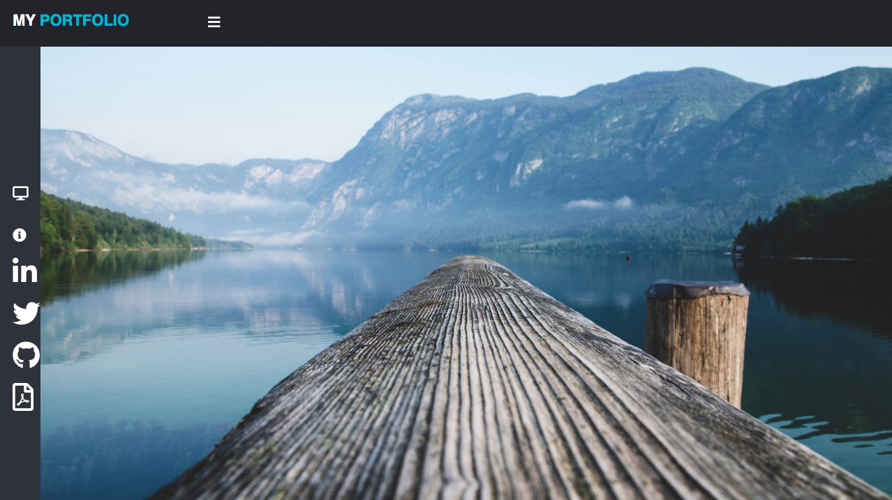

# Updated-Portfolio-3

## My Portfolio

## Link to the deployed application
-   [My Portfolio](https://stark-mesa-29665.herokuapp.com/)
## Getting Started 
Once you arrive at my page feel free to browse around. 
I have included 4 exemplary assignments as well 
as 2 team projects that I am quite proud of.

Below: I will provide a screenshot of each page of my portfolio webpage:

## Why make it?
As an aspiring full stack developer its important to provide potential recruiters and companies the ability to get a quick overview of my skill set. By providing a personal website with my accomplishments I am able to bridge the gap of uncertainty during the interview process.

## Technologies Used
- Express
- Materlize CSS
- Bootstrap CSS
- CSS
- GitHub - hosts repository
- Heroku - to host the application and the database
## Contributors
- [Alex Aguirrebena](https://github.com/Anotherarod)

